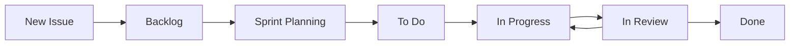

# Project Management Templates & Milestone Planning

## 🎯 Project Overview

**Project Name:** Portfolio Management System  
**Duration:** 2-3 weeks (Training Project)  
**Team Size:** 3-4 members  
**Methodology:** Agile

## 📅 Project Timeline & Milestones

### Week 1: Foundation & Core Backend (Days 1-7)
**Milestone 1: Backend Foundation**
- [ ] **Day 1-2:** Team onboarding & environment setup
- [ ] **Day 3-4:** Database schema & API Gateway foundation
- [ ] **Day 5-6:** Portfolio Service CRUD operations
- [ ] **Day 7:** Market Data Service basic integration

**Deliverables:**
- Working database with sample data
- API Gateway with basic routing
- Portfolio CRUD endpoints functional
- Market data fetching capability

### Week 2: Frontend & Integration (Days 8-14)
**Milestone 2: Full System Integration**
- [ ] **Day 8-9:** Frontend setup & basic dashboard
- [ ] **Day 10-11:** Analytics Service & calculations
- [ ] **Day 12-13:** Real-time notifications & WebSocket
- [ ] **Day 14:** End-to-end integration testing

**Deliverables:**
- Functional frontend dashboard
- Real-time data updates
- Performance analytics
- All services communicating

### Week 3: Polish & Presentation (Days 15-21)
**Milestone 3: Production Ready**
- [ ] **Day 15-16:** UI/UX improvements & testing
- [ ] **Day 17-18:** Performance optimization & documentation
- [ ] **Day 19-20:** Presentation preparation & demo data
- [ ] **Day 21:** Final presentation

**Deliverables:**
- Polished user interface
- Complete documentation
- Presentation slides
- Demo-ready system

## 📋 Epic & User Story Templates

### Epic Template
```markdown
# Epic: [Epic Name]

## Description
Brief description of the epic and its business value.

## Scope
- What's included
- What's excluded
- Dependencies

## Acceptance Criteria
- [ ] Criterion 1
- [ ] Criterion 2
- [ ] Criterion 3

## User Stories
- Link to related user stories
- Estimated effort: [Small/Medium/Large]

## Definition of Done
- [ ] All user stories completed
- [ ] Tests written and passing
- [ ] Code reviewed and merged
- [ ] Documentation updated
```

### User Story Template
```markdown
# User Story: [Story Name]

## Story
As a [user type], I want [functionality] so that [benefit].

## Acceptance Criteria
Given [context]
When [action]
Then [outcome]

## Technical Requirements
- Frontend changes needed
- Backend changes needed
- Database changes needed
- Third-party integrations

## Tasks
- [ ] Task 1 (Assigned: @username)
- [ ] Task 2 (Assigned: @username)
- [ ] Task 3 (Assigned: @username)

## Estimate
Story Points: [1/2/3/5/8]
Hours: [Estimated hours]

## Definition of Done
- [ ] Functionality implemented
- [ ] Unit tests written
- [ ] Integration tests pass
- [ ] Code reviewed
- [ ] Documentation updated
```

## 🏷️ Issue Labels & Categories

### Priority Labels
- `priority-critical` 🔴 - Must be done this sprint
- `priority-high` 🟠 - Should be done this sprint  
- `priority-medium` 🟡 - Could be done this sprint
- `priority-low` 🟢 - Future consideration

### Type Labels
- `feature` ✨ - New functionality
- `bug` 🐛 - Something isn't working
- `enhancement` 🚀 - Improve existing functionality
- `documentation` 📚 - Documentation changes
- `technical-debt` ⚡ - Code improvements
- `question` ❓ - Need clarification

### Component Labels
- `frontend` 🎨 - Frontend/UI related
- `backend` ⚙️ - Backend/API related
- `database` 🗃️ - Database related
- `infrastructure` 🏗️ - DevOps/Infrastructure
- `testing` 🧪 - Testing related

### Service Labels
- `api-gateway` - API Gateway service
- `portfolio-service` - Portfolio management
- `market-data-service` - Market data integration
- `analytics-service` - Analytics & calculations
- `notification-service` - Real-time notifications

## 📊 Sprint Planning Template

### Sprint Overview
```markdown
# Sprint [Number]: [Sprint Name]

**Duration:** [Start Date] - [End Date]  
**Sprint Goal:** [Primary objective for this sprint]

## Team Capacity
- [Team Member 1]: [Available hours/days]
- [Team Member 2]: [Available hours/days]
- [Team Member 3]: [Available hours/days]
- [Team Member 4]: [Available hours/days]

## Sprint Backlog
| Story | Assignee | Story Points | Status |
|-------|----------|--------------|--------|
| User Story 1 | @username | 3 | In Progress |
| User Story 2 | @username | 5 | To Do |
| Bug Fix 1 | @username | 1 | Done |

## Sprint Commitments
- Total Story Points: [X]
- Team Velocity: [Previous sprint average]
- Risk Items: [Any known risks]

## Definition of Done
- [ ] All committed stories completed
- [ ] All tests passing
- [ ] Code reviewed and merged
- [ ] Sprint retrospective completed
```

## 🔄 Daily Standup Template

### Standup Format (15 minutes max)
```markdown
# Daily Standup - [Date]

## [Team Member 1 Name]
**Yesterday:** What I completed
**Today:** What I'm working on
**Blockers:** Any impediments

## [Team Member 2 Name]
**Yesterday:** What I completed
**Today:** What I'm working on
**Blockers:** Any impediments

## [Team Member 3 Name]
**Yesterday:** What I completed
**Today:** What I'm working on
**Blockers:** Any impediments

## Action Items
- [ ] Action item 1 (Owner: @username)
- [ ] Action item 2 (Owner: @username)

## Sprint Progress
- Stories completed: [X/Y]
- Days remaining: [X]
- On track: [Yes/No/At Risk]
```

## 📈 Sprint Retrospective Template

### Retrospective Format
```markdown
# Sprint [Number] Retrospective

**Date:** [Date]  
**Participants:** [Team members present]

## Sprint Metrics
- Stories Planned: [X]
- Stories Completed: [Y]
- Story Points Planned: [X]
- Story Points Completed: [Y]
- Velocity: [Points per day]

## What Went Well 👍
- Item 1
- Item 2
- Item 3

## What Could Be Improved 🔄
- Item 1
- Item 2
- Item 3

## Action Items for Next Sprint 🎯
- [ ] Action item 1 (Owner: @username)
- [ ] Action item 2 (Owner: @username)
- [ ] Action item 3 (Owner: @username)

## Team Health Check
**Scale: 1 (Poor) to 5 (Excellent)**
- Communication: [Rating]
- Collaboration: [Rating]
- Code Quality: [Rating]
- Work-Life Balance: [Rating]
```

## 🎯 Definition of Ready & Done

### Definition of Ready (Before starting work)
- [ ] User story clearly defined
- [ ] Acceptance criteria documented
- [ ] Technical approach discussed
- [ ] Dependencies identified
- [ ] Estimated and sized
- [ ] Assigned to team member

### Definition of Done (Before marking complete)
- [ ] Functionality implemented per acceptance criteria
- [ ] Unit tests written and passing
- [ ] Integration tests passing
- [ ] Code reviewed by at least one team member
- [ ] Documentation updated
- [ ] Deployed to staging environment
- [ ] Manual testing completed
- [ ] No critical bugs identified

## 📋 Task Management Setup

### GitHub Projects Configuration

**Project Views:**
1. **Kanban Board**
   - Backlog → To Do → In Progress → In Review → Done
   
2. **Sprint View**
   - Filter by current sprint milestone
   - Group by assignee
   
3. **Roadmap View**
   - Timeline view of major milestones
   - Epic-level planning

**Automation Rules:**
- Auto-move to "In Progress" when PR is created
- Auto-move to "In Review" when PR is ready for review
- Auto-move to "Done" when PR is merged
- Auto-assign reviewers based on file changes

### Issue Workflow


## 🎨 Demo & Presentation Planning

### Demo Script Template
```markdown
# Demo Script - Portfolio Management System

## Introduction (2 minutes)
- Team introductions
- Project overview
- Technologies used

## Architecture Overview (3 minutes)
- High-level architecture diagram
- Microservices explanation
- Technology stack

## Live Demo (10 minutes)
1. **Portfolio Dashboard** (3 min)
   - Show portfolio overview
   - Add new holding
   - Update existing holding

2. **Real-time Updates** (3 min)
   - Market data integration
   - Live price updates
   - Performance calculations

3. **Analytics & Charts** (4 min)
   - Performance analytics
   - Risk metrics
   - Interactive charts

## Technical Highlights (3 minutes)
- Event-driven architecture
- Real-time WebSocket updates
- Docker containerization

## Challenges & Learnings (2 minutes)
- Technical challenges faced
- Team collaboration experience
- Key learnings

## Questions & Future Work (5 minutes)
- Q&A session
- Potential improvements
- Next steps if continued
```

## 📊 Success Metrics

### Technical Metrics
- [ ] 90%+ test coverage
- [ ] All CI/CD pipelines passing
- [ ] Zero critical security vulnerabilities
- [ ] API response times < 500ms
- [ ] Frontend load time < 2 seconds

### Team Metrics
- [ ] 100% sprint commitment achieved
- [ ] All team members contributed code
- [ ] Daily standups conducted
- [ ] Code review completion within 24 hours
- [ ] Documentation coverage > 80%

### Learning Objectives
- [ ] Microservices architecture understanding
- [ ] Event-driven design patterns
- [ ] Modern frontend development (React/Next.js)
- [ ] Backend development (Go)
- [ ] DevOps practices (Docker/CI-CD)
- [ ] Team collaboration & git workflow

---

**Implementation Notes:**
1. Customize templates based on team preferences
2. Adjust sprint length based on project timeline
3. Adapt metrics to match learning objectives
4. Use tools that team is comfortable with
5. Focus on learning over perfection