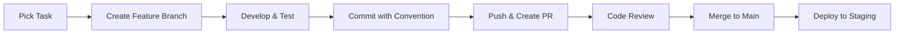

# Team Collaboration Guide

## 🎯 Overview

This guide provides step-by-step instructions for setting up and managing collaboration for the Portfolio Management System project.

**Team Composition:** 3-4 members (mix of backend/frontend developers)
**Project Duration:** Training project (2-3 weeks)
**Repository:** Your existing repo for team collaboration

## 📋 Quick Setup Checklist

### Phase 1: Immediate Setup (Day 1)
- [ ] Create remote Git repository
- [ ] Configure team access and permissions
- [ ] Set up branch protection rules
- [ ] Create project board for task management
- [ ] Establish communication channels
- [ ] Complete team onboarding

### Phase 2: Development Workflow (Day 2-3)
- [ ] Implement CI/CD pipeline
- [ ] Configure automated testing
- [ ] Set up code review process
- [ ] Define coding standards
- [ ] Create deployment strategy

## 🔧 Git Repository Setup

### 1. Create Remote Repository

**Option A: GitHub (Recommended for Training)**
```bash
# Create repository on GitHub
# Repository name: portfolio-management-system
# Description: Microservices-based Portfolio Management System
# Visibility: Private (for team collaboration)

# Add remote origin
git remote add origin https://github.com/YOUR_USERNAME/portfolio-management-system.git
git branch -M main
git push -u origin main
```

**Option B: GitLab**
```bash
# Similar process on GitLab
git remote add origin https://gitlab.com/YOUR_USERNAME/portfolio-management-system.git
```

### 2. Team Access Configuration

**GitHub Teams Setup:**
- **Team Lead (You):** Admin access
- **Backend Developers (2):** Write access
- **Frontend Developer (1):** Write access

**Invitation Process:**
1. Go to Repository Settings → Manage access
2. Click "Invite a collaborator"
3. Add team members by username/email
4. Assign appropriate role (Write for developers)

### 3. Branch Protection Rules

**Main Branch Protection (Essential for Team Work):**
```yaml
# Navigate to: Settings → Branches → Add rule
Branch name pattern: main
Restrictions:
  ✅ Require pull request reviews before merging
  ✅ Require status checks to pass before merging
  ✅ Require branches to be up to date before merging
  ✅ Include administrators
  ✅ Restrict pushes that create files larger than 100MB
```

**Branch Strategy:**
```
main (protected)
├── develop (protected)
├── feature/portfolio-dashboard
├── feature/market-data-integration
├── feature/analytics-service
└── hotfix/critical-bug-fix
```

## 📊 Task Management Setup

### Option 1: GitHub Projects (Recommended)

**Create Project Board:**
1. Go to repository → Projects → New project
2. Choose "Board" template
3. Configure columns:
   - 📋 **Backlog** - All planned tasks
   - 🔄 **In Progress** - Currently being worked on
   - 👀 **In Review** - Pull requests under review
   - ✅ **Done** - Completed tasks
   - 🚫 **Blocked** - Tasks waiting for dependencies

**Issue Labels:**
- `frontend` - Frontend-related tasks
- `backend` - Backend-related tasks
- `api-gateway` - API Gateway specific
- `portfolio-service` - Portfolio service
- `market-data` - Market data service
- `analytics` - Analytics service
- `notification` - Notification service
- `bug` - Bug fixes
- `enhancement` - New features
- `documentation` - Documentation updates
- `priority-high` - High priority
- `priority-medium` - Medium priority
- `priority-low` - Low priority

### Option 2: Trello (Alternative)

**Board Structure:**
- **Sprint Backlog** → **Doing** → **Code Review** → **Testing** → **Done**

## 👥 Team Roles & Responsibilities

### Team Lead (Full-Stack)
**Primary Responsibilities:**
- Overall architecture decisions
- Code review coordination
- Sprint planning and task assignment
- Integration between services
- DevOps and deployment setup

**Weekly Commitments:**
- Daily standup facilitation (15 min)
- Sprint planning (1 hour)
- Code reviews (30 min/day)
- Integration testing
- Team mentor support

### Backend Developer 1 - Go Services
**Primary Focus:**
- Portfolio Service development
- Market Data Service development
- Database schema design
- API endpoint implementation

**Key Tasks:**
- Implement portfolio CRUD operations
- Integrate Yahoo Finance API
- Database optimization
- Unit testing for services

### Backend Developer 2 - API Gateway & Analytics
**Primary Focus:**
- API Gateway routing and middleware
- Analytics Service development
- Notification Service development
- Event-driven communication (NATS)

**Key Tasks:**
- Request routing and authentication
- Performance analytics calculations
- Real-time notifications via WebSocket
- Inter-service communication

### Frontend Developer - Next.js
**Primary Focus:**
- User interface development
- Data visualization components
- Real-time dashboard updates
- User experience optimization

**Key Tasks:**
- Portfolio dashboard components
- Interactive charts with D3.js/Recharts
- WebSocket integration
- Responsive design implementation

## 🔄 Development Workflow

### Daily Workflow


### Branch Naming Convention
```bash
# Feature branches
feature/portfolio-dashboard
feature/market-data-integration
feature/real-time-notifications

# Bug fixes
fix/database-connection-issue
fix/api-authentication-error

# Hotfixes
hotfix/critical-security-patch

# Documentation
docs/api-documentation-update
```

### Commit Message Examples
```bash
# Good commits (following existing convention)
feat(frontend): add portfolio dashboard with charts
fix(api): resolve database connection timeout issue
docs: update setup instructions for new team members
test(portfolio): add unit tests for portfolio calculations
refactor(services): optimize database queries performance
```

## 📞 Communication Channels

### Primary Communication
**Daily Standups:** 15 minutes, same time each day
- What did you complete yesterday?
- What will you work on today?
- Any blockers or help needed?

**Weekly Sprint Planning:** 1 hour every Monday
- Review completed work
- Plan next sprint tasks
- Assign responsibilities
- Identify dependencies

### Communication Tools
**Option 1: Discord/Slack**
- `#general` - General team discussion
- `#development` - Technical discussions
- `#code-review` - Code review requests
- `#help` - Ask for help
- `#random` - Non-work related

**Option 2: Microsoft Teams/Google Meet**
- Regular video calls
- Screen sharing for debugging
- Recording for absent members

## 🧪 Testing Strategy

### Frontend Testing
```bash
cd frontend
pnpm test              # Run all tests
pnpm test:watch        # Watch mode for development
pnpm test:coverage     # Generate coverage report
```

### Backend Testing
```bash
# In each service directory
go test ./...          # Run all tests
go test -v ./...       # Verbose output
go test -cover ./...   # Coverage report
```

### Integration Testing
```bash
# Full system testing
docker-compose -f docker-compose.test.yml up --abort-on-container-exit
```

## 🚀 Deployment Strategy

### Development Environment
```bash
# Local development (each developer)
pnpm install
pnpm run setup
pnpm run dev
```

### Staging Environment
```bash
# Automated deployment on merge to main
docker-compose build
docker-compose up -d
```

### Production Deployment
```bash
# Manual deployment for now
pnpm run build
docker-compose -f docker-compose.prod.yml up -d
```

## 📈 Project Milestones

### Week 1: Foundation & Core Features
- [x] Project setup and team onboarding
- [ ] Basic portfolio CRUD operations
- [ ] Market data integration
- [ ] Simple dashboard frontend
- [ ] API Gateway routing

### Week 2: Advanced Features & Integration
- [ ] Real-time data updates
- [ ] Performance analytics
- [ ] Interactive charts
- [ ] WebSocket notifications
- [ ] End-to-end testing

### Week 3: Polish & Presentation
- [ ] UI/UX improvements
- [ ] Performance optimization
- [ ] Documentation completion
- [ ] Presentation preparation
- [ ] Demo data setup

## 🎯 Success Metrics

**Technical Goals:**
- ✅ All services running in Docker
- ✅ Frontend connected to backend APIs
- ✅ Real-time data updates working
- ✅ Test coverage > 70%
- ✅ No critical bugs in main branch

**Team Goals:**
- ✅ Daily standups completed
- ✅ All PRs reviewed within 24 hours
- ✅ Git commit conventions followed
- ✅ Documentation kept up-to-date
- ✅ Team members learning and contributing

## ⚠️ Common Pitfalls to Avoid

1. **Scope Creep:** Stick to minimal viable product first
2. **Merge Conflicts:** Regular pulls from main branch
3. **Code Reviews:** Don't merge without review
4. **Testing:** Write tests as you develop, not after
5. **Communication:** Over-communicate rather than under-communicate

## 🆘 Troubleshooting

### Git Issues
```bash
# Merge conflicts
git status
git merge --abort  # If needed
git pull origin main
# Resolve conflicts manually
git add .
git commit -m "resolve merge conflicts"

# Sync with main branch
git checkout main
git pull origin main
git checkout your-feature-branch
git rebase main
```

### Development Issues
- Check Docker containers: `docker-compose ps`
- View logs: `docker-compose logs -f service-name`
- Reset environment: `pnpm run clean && pnpm run setup`

---

**Next Steps:** Proceed to implement this collaboration setup step by step. Each team member should review this guide and confirm their understanding before starting development.